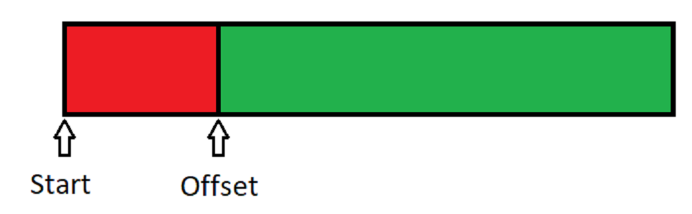
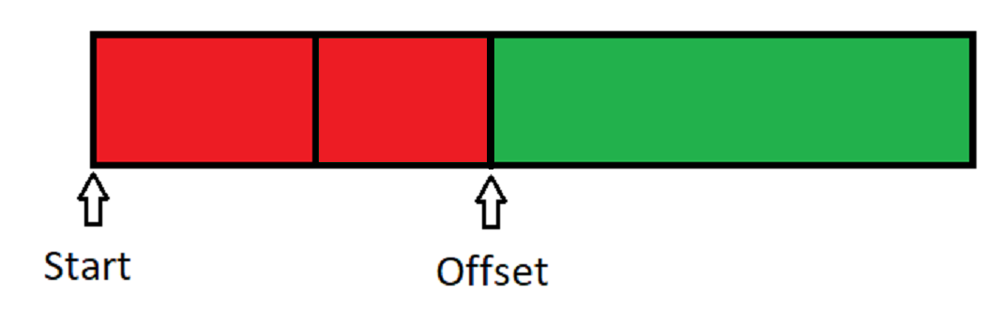
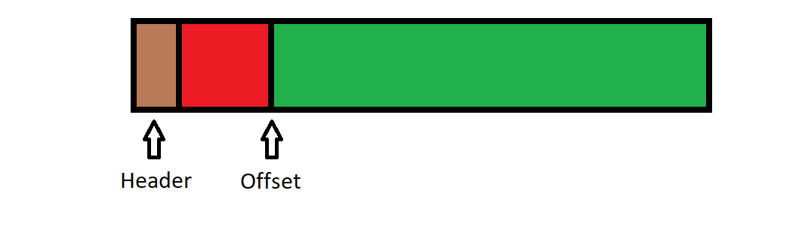
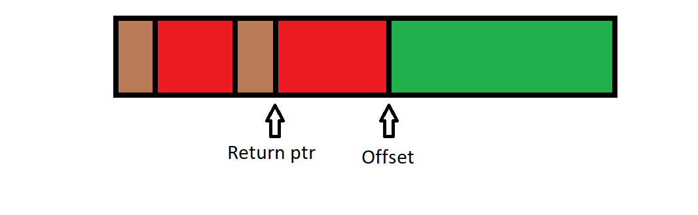
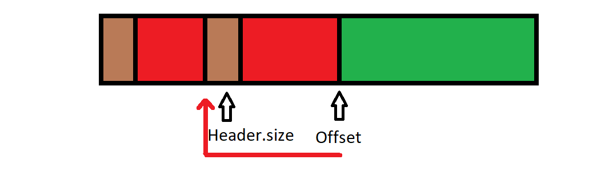

# HSA
Header-only Simple Allocators. 
---
#### A collection of allocators, written in c++, in a single header.
---

The goal for this project is to provide well-written allocators that are easy to integrate into a project, provide sample projects on how to use and extend the collection and provide a good overview of the implementation of the allocators.

The code is written with a focus on readability and portability. 
It also means that this code is written with as few as possible dependencies. If there is code that does have a dependency, this code will be optional.

# How to... 
---
## use
This collection exists of only one header: ```hsa.h```
You are free to choose how to include this into a project.

it is recommended to only include this header in source files (.cpp). 

To enable the implementation, define ```#define HSA_IMPLEMENTATION``` before including. 

to disable ```assert()``` define ```#define HSA_DONT_ASSERT```
this might be required by some application to be able to distribute it. Do not disable ```assert()``` if not absolutely necessary.  

## extend
All allocators except the bitmap allocator are written in such a way that you can inherit from them. A base class ```Allocator``` is provided so that it is possible to write allocators that are compatible with the allocators that are provided.


# implementation
---
Any allocator with a ✔ next to it is implemented. Others are planned or currently in progress.

## Linear Allocator ✔
The linear allocator is the simplest allocator you can make. Memory is allocated by moving one pointer or offset forward until the maximum amount of memory is allocated for the allocator. Fragmentation of the allocator is minimal. All allocations are sequential and memory is guaranteed to be contiguous(if alignment allows for it). This allocator can't deallocate memory but it can be reset.

#### Structure



##### Allocate()


## Stack Allocator ✔
The stack allocator is one step up from the linear allocator. It uses the same technique by moving a pointer or offset forward. The stack allocator allows for deallocation by inserting a header in front of the memory allocation. this header is used to make this part of memory as free and to have a pointer to the preceding block of memory. just like the linear allocator, the memory will be contiguous. This does include the header. alignment might add small amounts of unallocated memory.

#### Structure


##### Allocate()

##### Free()


## Bitmap Allocator ✔
The bitmap allocator as the name suggests uses a bitmap to keep track of allocated blocks. each block of memory is the same size. That makes this allocator a good candidate for objects like GameObjects or Entities in a game. The memory used by this allocator is guaranteed to be contiguous but the implementation prefers a linear way of allocating. this means that if you deallocate memory in the allocator this memory will be a gap. This approach is chosen because of its simplicity.

## Contiguous memory Free list Allocator ✔
The free list allocator is a very general allocator and can be used for a lot of applications. This allocator does not provide the speed that the linear or stack allocator provide. But just like the linear and stack allocator, it does not matter what the size you want to allocate as long as it fits in the pre-allocated memory. This free list allocator makes use of a ordered singlely linked list.

## Dynamic memory Free list Allocator
This allocator solves one of the problems that the Contiguous memory free list allocator has. The dynamic memory free list allocator will allow you to allocate more than the initial allocation. This allocator is designed to allocate more memory when it needs it. this does mean that it no longer can guarantee that it is contiguous memory and some allocations take more time because it needs to interact with the system to get more memory.

---
###Future work / TODO

- Implement thread safety
- Write examples.
- Write wrapper for STL compatibility (std::Allocator for std::vector, std::map, etc)
- provide images for implementation.

